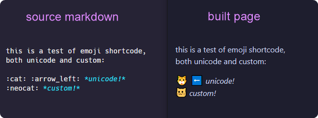
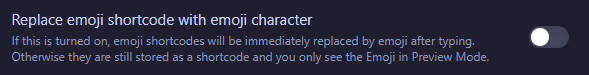
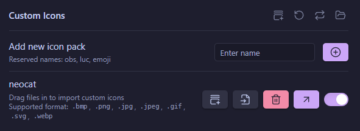

# Markdown-It-Emoji Customizer

- [Installation](#installation)
- [Options](#options)
- [Options Details & Examples](#options-details-and-examples)
- [Scanning for Custom Emoji Images](#scanning-for-custom-emoji-images)
- [My Use with Obsidian](#my-use-with-obsidian)
- [Credits](#credits)

---

This is a helper module for [markdown-it-emoji](https://github.com/markdown-it/markdown-it-emoji), designed primarily as an [11ty](https://11ty.dev) plugin, that enhances functionality by enabling the use of custom emoji shortcodes, defined by scanning a path for emoji images and building the definitions, emoji definition merging/overwriting/selection (integrating custom emoji definitions with the standard unicode sets from `markdown-it-emoji` if desired), and options for customizing the generated custom emoji and unicode emoji HTML elements.

In practice, it can [scan a provided path for custom emoji](#scanning-for-custom-emoji-images) and build the definitions, lets you configure the [`` attributes for the custom emoji](#customemojiimgattributes), configure class names for both the [custom emoji `<span>` class](#customemojispanclass) and the [unicode emoji `<span>` class](#unicodeemojispanclass) (all of which can help with [styling](#styling)), and more! It's also intended to be compatible with the Obsidian plugin [obsidian-icon-shortcodes](https://github.com/aidenlx/obsidian-icon-shortcodes) (see [my use with Obsidian](#my-use-with-obsidian) for more info!)

This plugin includes a variety of [options](#options) for flexibility, all with sensible defaults. See [Options Details and Examples](#options-details-and-examples) for more info.

---

## Demo

<p align="center">
  
</p>

> [!IMPORTANT]
> - This plugin **does not** include any custom emoji images!
>   - (see [scanning for custom emoji images](#scanning-for-custom-emoji-images))

### Rendered HTML
The rendered HTML from this plugin (with default [options](#options)) for unicode and custom emoji shortcodes is like:
```html
<span class="unicode-emoji--span">🐱</span>
<span class="custom-emoji--span"></span>
```

---

## Installation
> **Note**: This project declares `markdown-it-emoji` as a peer dependency, so be sure to have it installed in your project!
>
> The first installation method below installs `markdown-it-emoji` along with this plugin, if needed.

Install this plugin (along with [`markdown-it-emoji`](https://github.com/markdown-it/markdown-it-emoji)) in your project with:
```bash
npm install markdown-it-emoji github:actuallysomecat/markdown-it-emoji-customizer
```
*or* add it manually to your `package.json` dependencies: 
```json
{
  "dependencies": {
    "markdown-it-emoji-customizer": "github:actuallysomecat/markdown-it-emoji-customizer"
  }
}
```
then run `npm install` in your project directory.

> [!WARNING]
> If installing manually (the second method, adding it to `package.json`), ensure that `markdown-it-emoji` is installed in your project as well! You don't need to import `markdown-it-emoji` or apply it in your markdown `.use()` chain in the 11ty config, this plugin will just automatically make use of the installed `markdown-it-emoji`.

### 11ty config (using `addPlugin`)
In your 11ty config (`eleventy.config.js`), where you set up your markdown-it chain and library, add this plugin (with `addPlugin()`) **before** setting the library with `setLibrary()`, like:
```js
import MarkdownIt from 'markdown-it'
import markdownItEmojiCustomizer from 'markdown-it-emoji-customizer'
// NOTE: you do not need to `import` markdown-it-emoji! just have it installed.

// ... other 11ty configuration ...

// create the markdown-it instance, configuring as typical with any plugins:
const md = new MarkdownIt(mdOptions)
  .use(someMarkdownItPlugin)
  // ... any additional plugins ...

// prepare the options for markdown-it-emoji-customizer
// only the required `md` is provided here, the rest of the options will use defaults
// (see Options in readme for option availability and their defaults)
const emojiOptions = { md }

// add the plugin using the options
// NOTE: do this before calling `setLibrary()`!
eleventyConfig.addPlugin(markdownItEmojiCustomizer, emojiOptions)

// then set the newly modified markdown library:
eleventyConfig.setLibrary("md", md)

  // ... rest of eleventy.config.js ...
```

---

## Options

| Option                                                | Type                                                                     | Default                 |
|-------------------------------------------------------|--------------------------------------------------------------------------|-------------------------|
| [md](#md)                                             | markdown-it instance                                                     | --                      |
| [emojiDir](#emojidir)                                 | `string`                                                                 | `"./public/img/emoji/"` |
| [baseUrl](#baseurl)                                   | `string`                                                                 | `"/img/emoji/"`         |
| [mergeDefs](#mergedefs)                               | `boolean`                                                                | `true`                  |
| [baseUnicodeEmojiSet](#baseunicodeemojiset)           | `string`                                                                 | `"full"`                |
| [customEmojiImgAttributes](#customemojiimgattributes) | `object{}` or [`function()`](#example-customemojiimgattributes-function) | `{}`                    |
| [customEmojiSpanClass](#customemojispanclass)         | `string`                                                                 | `"custom-emoji--span"`   |
| [unicodeEmojiSpanClass](#unicodeemojispanclass)       | `string`                                                                 | `"unicode-emoji--span"`  |
| [shortcuts](#shortcuts)                               | `boolean` or `object{}`                                                  | `false`                 |
| [mergeShortcuts](#mergeshortcuts)                     | `boolean`                                                                | `true`                  |
| [allowedEmoji](#allowedemoji)                         | `string[]`                                                               | undefined               |

> [!TIP]
>
> **Copypaste-friendly default options object template**
> 
> Any of these options (**other than `md`**) that are omitted in your custom options object will use their default value. Custom options get merged over the defaults.
>
> **`md` is required!**
> ```js
> const emojiOptions = {
>   md, // the markdown-it instance (required!)
>   emojiDir: './public/img/emoji/',
>   baseUrl: '/img/emoji/',
>   mergeDefs: true,
>   baseUnicodeEmojiSet: 'full',
>   customEmojiImgAttributes: {},
>   customEmojiSpanClass: 'custom-emoji--span',
>   unicodeEmojiSpanClass: 'unicode-emoji--span',
>   shortcuts: false,
>   mergeShortcuts: true,
>   // allowedEmoji: ,
>}
> ```

---

## Options Details and Examples

### md
**(Required!)**

the markdown-it library (*before* `setLibrary()` in `eleventy.config.js`).

<p align="right"><a href="#options">back to Options</a> 🔼 | <a href="#markdown-it-emoji-customizer">back to top</a> ⏫</p>

### emojiDir

**Default:** `"./public/img/emoji/"`

The local path for the root emoji dir (for [scanning for custom emoji image files](#scanning-for-custom-emoji-images))

Emoji can be in this root emoji dir or in subdirs of it as 'collections' or 'packs' (see [my obsidian-icon-shortcodes setup](#my-use-with-obsidian) as an example of how that might be useful).

> [!NOTE]
> If emoji are in this root emoji dir with no subdir, the emoji shortcodes are generated as `:name:` (the filename with no extension and no path).
>
> In cases of emoji being in subdirs in this path, the generated shortcodes are prefixed with the final subdir and an underscore (e.g. `./public/img/emoji/neocat/neocat_3c.png` would be shortcode `:neocat_neocat_3c:` and it would correspond to `<baseUrl>/neocat/neocat_3c.png` on the built site.)

<p align="right"><a href="#options">back to Options</a> 🔼 | <a href="#markdown-it-emoji-customizer">back to top</a> ⏫</p>

### baseUrl

**Default:** `"/img/emoji/"`

The base url on the built site where the root emoji dir will be.

I have my emoji in 11ty's `/public/` dir as `./public/img/emoji/` which gets output to my site build as `/img/emoji/`.

The structure of this root path should match the structure of `emojiDir` (e.g. if you use subdirs in `emojiDir`, you should use the same subdir structure on your site. If you put all emoji images in the `emojiDir` root, put all the emoji images in this root on the site, etc.)

<p align="right"><a href="#options">back to Options</a> 🔼 | <a href="#markdown-it-emoji-customizer">back to top</a> ⏫</p>

### mergeDefs

**Default:** `true`

Whether to merge the custom emoji set and the base unicode emoji set (below).

<p align="right"><a href="#options">back to Options</a> 🔼 | <a href="#markdown-it-emoji-customizer">back to top</a> ⏫</p>

### baseUnicodeEmojiSet

**Default:** `"full"`

Valid options:
- **"none"**
  - no shortcode-to-unicode emoji definitions
- **"light"**
  - shortcode-to-unicode emoji definitions using the [light](https://github.com/markdown-it/markdown-it-emoji/blob/master/lib/data/light.mjs) bindings from `markdown-it-emoji`
- **"full"**
  - shortcode-to-unicode emoji definitions using the [full](https://github.com/markdown-it/markdown-it-emoji/blob/master/lib/data/full.mjs) bindings from `markdown-it-emoji`

<p align="right"><a href="#options">back to Options</a> 🔼 | <a href="#markdown-it-emoji-customizer">back to top</a> ⏫</p>

### customEmojiImgAttributes

**Default:** `{}` (will use internal defaults, see Note below)

An object (or [function](#example-customemojiimgattributes-function)!) providing attributes for the custom emoji `` tags.

> [!NOTE]
> These will be merged into/over the internal defaults, which are
> ```js
> { alt: `emoji: ${emojiName}`, class: 'custom-emoji--img', 'eleventy:ignore':true }
> ```
>
> which means leaving this as an empty object or omitting it from the options will use those default attributes for the `` tags of custom emoji. Overriding any of those specific attributes in this `customEmojiAttributes` object **will override those defaults**. Anything else in this object which isn't present in those defaults gets *added to* the resulting `` tags.
> 
> Empty strings *will* be used if included! For example, setting `customEmojiImgAttributes: { alt: '' }` will result in the `` tags having the attribute `alt=""`.

> [!TIP]
> This can also be a function which returns an object! ([Example](#example-customemojiimgattributes-function)).

If this is a function, it will have access to the [`emojiMeta`](#emojimeta) and [`defaultImgAttributes`](#defaultimgattributes) below:

#### emojiMeta
`emojiMeta` is an object containing the following data about an emoji token being processed:
- `emojiName` (`string`)
  - this is the name (the filename, without extension, without path) of the emoji being processed
    - (e.g. `'neocat'`)
- `emojiFilename` (`string`)
  - this is the full filename with path and extension of the emoji being processed
    - (e.g. `/img/emoji/neocat/neocat.png`)
- `emojiSubdir` (`string`)
  - this is the *subdir* of the emoji being processed, aka the 'collection' or 'set'
    - (e.g. `/img/emoji/neocat/neocat.png` would have `'neocat'` for this value)
- `rawShortcode` (`string`)
  - this is the raw shortcode of the emoji being processed (without colons)
    - (e.g. `/img/emoji/neocat/neocat_3c.png` would be `neocat_neocat_3c`, `/img/emoji/neocat.png` would be `neocat`)
      - if the custom emoji is in the *root* of [emojiDir](#emojidir), the shortcode will be simply `${name}`.
      - if the custom emoji is in a *subdir* of [emojiDir](#emojidir), the shortcode for custom emoji is in the format `${subdir}_${name}`, to be more compatible with the [obsidian-icon-shortcodes setup](#obsidian-icon-shortcodes-settings-and-notes) (and avoid potential custom emoji name collisions)

#### defaultImgAttributes
`defaultImgAttributes` is an object containing the initial **default** `` tag attributes:
- ``alt: `emoji: ${emojiName}` ``
- `class: 'custom-emoji--img'`
- `'eleventy:ignore': true`
  - this is for `eleventy-img` processing, to make sure the emoji images don't get optimized. It is only included in the default `` attributes when this plugin is being used with 11ty (via `addPlugin()`), and shouldn't end up in the final rendered HTML, if using `eleventy-img`.

> [!TIP]
> Any custom attributes will be merged over those defaults, keeping any defaults that don't have an override!

#### Example customEmojiImgAttributes Function
This is an example custom function for `customEmojiImgAttributes` which is
- changing `alt` attribute using the `emojiName` and `rawShortcode`
- changing `class` attribute
  - if the emoji *is* in a subdir, use the subdir as part of the class name
  - if the emoji *is not* in a subdir, just give it a class `custom-emoji--class`)
```js
const myCustomEmojiImgAttributes = (emojiMeta) => ({
    alt: `${emojiMeta.emojiName} (shortcode: ${emojiMeta.rawShortcode})`,
    class: emojiMeta.emojiSubdir
      ? `${emojiMeta.emojiSubdir}-emoji--class`
      : 'custom-emoji--class'
	});
```
So, when processing an emoji shortcode `:neocat_neocat_3c:` which is for `/img/emoji/neocat/neocat_3c.png`, using the function above for `customEmojiImgAttributes`, it would result in the `` tag having:
```js
alt="neocat_3c (shortcode: neocat_neocat_3c)",
class="neocat-emoji--class"
```
and when processing an emoji shortcode `:neocat:` which is for `/img/emoji/neocat.png` (note: it is in the emoji root, no subdir) using the function above for `customEmojiImgAttributes`, it would result in the `` tag having:
```js
alt="neocat (shortcode: neocat)",
class="custom-emoji--class"
```

<p align="right"><a href="#options">back to Options</a> 🔼 | <a href="#markdown-it-emoji-customizer">back to top</a> ⏫</p>

### customEmojiSpanClass

**Default:** `"custom-emoji--span"`

The `class` name on the `<span>` wrapping the custom emoji `` tags.

<p align="right"><a href="#options">back to Options</a> 🔼 | <a href="#markdown-it-emoji-customizer">back to top</a> ⏫</p>

### unicodeEmojiSpanClass
**Default:** `"unicode-emoji--span"`

The `class` name on the `<span>` wrapping the unicode emoji.

<p align="right"><a href="#options">back to Options</a> 🔼 | <a href="#markdown-it-emoji-customizer">back to top</a> ⏫</p>

### shortcuts

**Default:** `false`

A **boolean** *or* **object** containing shortcuts:

- `true`: use the [default shortcuts](https://github.com/markdown-it/markdown-it-emoji/blob/master/lib/data/shortcuts.mjs) from `markdown-it-emoji`.
- `false`: do not.
- `object{}`: use your own custom shortcuts instead (in the format of the default, linked above)

<p align="right"><a href="#options">back to Options</a> 🔼 | <a href="#markdown-it-emoji-customizer">back to top</a> ⏫</p>

### mergeShortcuts

**Default:** `true`

If using a custom shortcuts object ([above](#shortcuts)), this controls whether to merge those into the default shortcuts (`true`), or use them without any default shortcuts (`false`)

<p align="right"><a href="#options">back to Options</a> 🔼 | <a href="#markdown-it-emoji-customizer">back to top</a> ⏫</p>

### allowedEmoji
**(Optional)**

**Default:** `undefined`

An allowlist array of emoji shortcodes. *Only* the shortcodes in this array will be processed.

If `undefined` (omitted from the options), this will not be used. 

<p align="right"><a href="#options">back to Options</a> 🔼 | <a href="#markdown-it-emoji-customizer">back to top</a> ⏫</p>

---

## Scanning for Custom Emoji Images
The `emojiDir` option (default `./public/img/emoji/`) is a local path to be scanned for custom emoji images for the plugin to use in building the definitions. Ideally the custom emoji should be organized into subdirs, where a subdir represents [a 'pack' (or 'collection') of custom emoji](#emoji-packs-in-the-obsidian-icon-shortcodes-plugin), but they can also simply be in this root emoji dir.

The filenames (without path and without extension) becomes the proper names of the emoji and is joined with the subdir by an underscore separator as the shortcode.

**Example:**
`emojiDir: './public/img/emoji/'`
`baseUrl: '/img/emoji/'`
with some emoji filenames like:
```
./public/img/emoji/neocat.png
./public/img/emoji/subdir/meow.png
```
results in definitions for two custom emoji (`:neocat:` and `:meow:`).
With the [default options](#options) this plugin would use those shortcodes in markdown to generate HTML like:
```html
<span class="custom-emoji--span"></span>
<span class="custom-emoji--span"></span>
```

<p align="right"><a href="#options">back to Options</a> 🔼 | <a href="#markdown-it-emoji-customizer">back to top</a> ⏫</p>

---

## Styling
I'm using the following base `css` on my site (with some modifications) to style the unicode and custom emoji `<span>`s and the custom emoji ``, to get them to be more uniform in appearance. Feel free to use or modify this for your own purposes:
```css
/* variables in root: */
  /* custom emoji specific */
  --emoji-icon-size: 1.5em;
  --emoji-icon-vertical-align: -0.3em;
  /* unicode emoji specific */
  --unicode-emoji-size: 1.2em;
  --unicode-line-height: 0em;
/* end of variables in root: */

/* unicode/custom emoji */
.unicode-emoji--span {
  display: inline-flex;
  justify-content: center;
  align-items: center;
  position: relative;
  font-size: var(--unicode-emoji-size);
  line-height: var(--unicode-line-height);
}
.custom-emoji--span {
  display: inline-block;
  position: relative;
  width: var(--emoji-icon-size);
  height: var(--emoji-icon-size);
  vertical-align: var(--emoji-icon-vertical-align);
}
.custom-emoji--img {
  display: block;
  width: 100%;
  height: 100%;
}
```

<p align="right"><a href="#options">back to Options</a> 🔼 | <a href="#markdown-it-emoji-customizer">back to top</a> ⏫</p>

---

## My Use with Obsidian
> [!TIP]
> This plugin is intended to be compatible with the [Obsidian](https://obisidian.md) plugin [obsidian-icon-shortcodes](https://github.com/aidenlx/obsidian-icon-shortcodes), though it doesn't require it. Any matching and allowed shortcodes in markdown will be converted.

### obsidian-icon-shortcodes Settings and Notes

With the [obsidian-icon-shortcodes](https://github.com/aidenlx/obsidian-icon-shortcodes) plugin, I have its option `Replace emoji shortcode with emoji character` **disabled** (see pic), so that a shortcode for a unicode emoji like `:cat:` **remains** as `:cat:` in the markdown file, rather than having Obsidian replace it with 🐱.

The reason is that I want the actual shortcode `:cat:` to be present in the markdown for `markdown-it-emoji-customizer` to process.

<p align="center">
  
</p>

#### Emoji Packs in the obsidian-icon-shortcodes Plugin
The idea is that "packs" of emoji will be present as subdirs in your root emoji folders, and also added to the `obsidian-icon-shortcodes` plugin settings as an "icon pack" (if using Obsidian and that plugin).

##### Example (neocat)
For example, to use the [neocat emoji](https://volpeon.ink/emojis/neocat/) (license: [CC-BY-NC-SA-4.0](https://spdx.org/licenses/CC-BY-NC-SA-4.0.html)) made by [Volpeon](https://volpeon.ink/):
- download, extract, and place the `neocat` dir containing the `png` files into your root emoji dir (resulting in something like `/img/emoji/neocat/*.png`)
- then, in the obsidian-icon-shortcodes plugin settings, `Add new icon pack` with a name matching that subdir name (`neocat`, in this example)
- then, import the emoji (`*.png`, in this example) from the `neocat` subdir into the new pack that was created, using the `select files to import` button in the Obsidian plugin's settings (or drag and drop, as per the plugin settings instructions)

<p align="center">
  
</p>

**Result:** they will have shortcodes within Obsidian like `:neocat_neocat:`, where `neocat_` is the name of the pack you just created (the underscore added by the plugin as a separator). Autocomplete/suggest works in Obsidian to insert emoji by shortcode, so beginning to type `:neo` should narrow it down and save some typing :3
After scanning the emoji dir with `markdown-it-emoji-customizer` and building definitions, the shortcodes it expects will match what `obsidian-icon-shortcodes` is inserting (e.g. Obsidian autocompletes to `:neocat_neocat_3c:` and the markdown-it-emoji-customizer plugin will have built definitions based on the subdir convention (if used), so definitions will be something like `:neocat_neocat_3c:`, so it can convert those to the `` wrapped in `<span>`! :3

The [demo](#demo) at the top of this readme shows the result.

> [!TIP]
> **Reminder:**
> - the icon pack name should be the same as the subdir name! (`neocat`, in this example)
> - `markdown-it-emoji-customizer` does not require using Obsidian! This is bonus information that `markdown-it-emoji-customizer` does not rely on, in standard use!

<p align="right"><a href="#options">back to Options</a> 🔼 | <a href="#markdown-it-emoji-customizer">back to top</a> ⏫</p>

---

## Credits

This plugin has a dependency for [`globby`](https://github.com/sindresorhus/globby) and a peer dependency for [`markdown-it-emoji`](https://github.com/markdown-it/markdown-it-emoji).

> [!IMPORTANT]
> Thanks and shoutout to [Volpeon](https://volpeon.ink/) for making neat [emoji sets](https://volpeon.ink/emojis/) like the [neocat](https://volpeon.ink/emojis/neocat/) set, which are so good they inspired/motivated me to create this plugin to more easily use them in my Obsidian-backed 11ty blog! ❤

---

## Meow
meow :3
